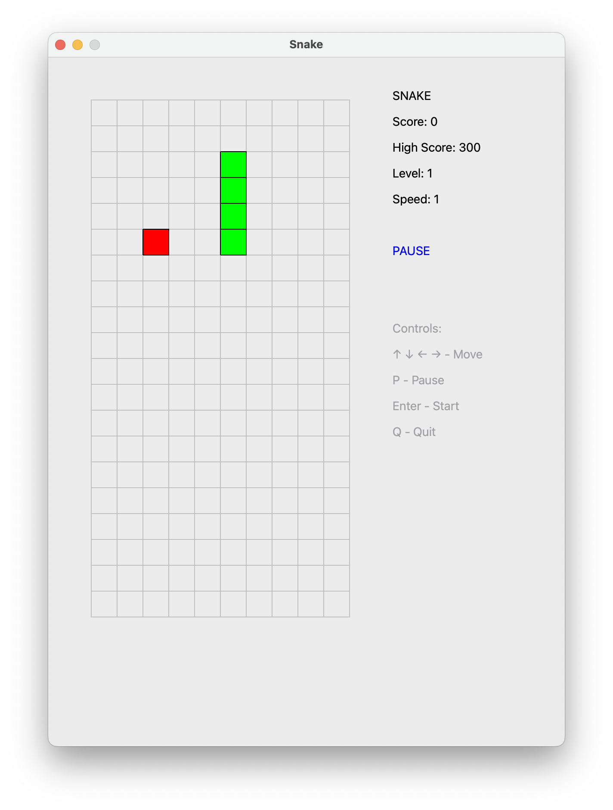
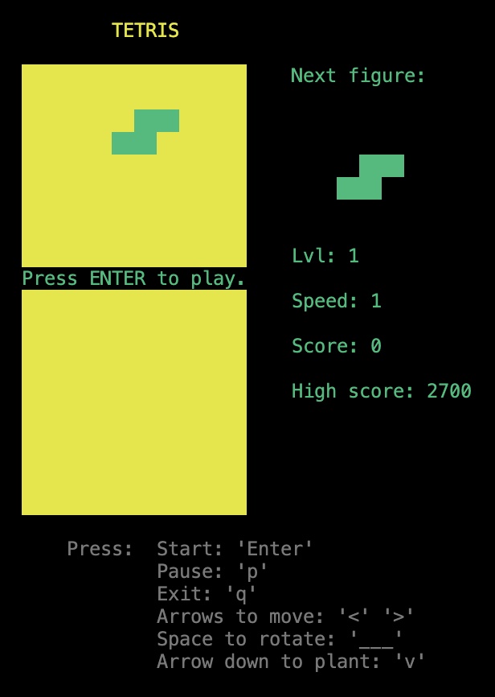
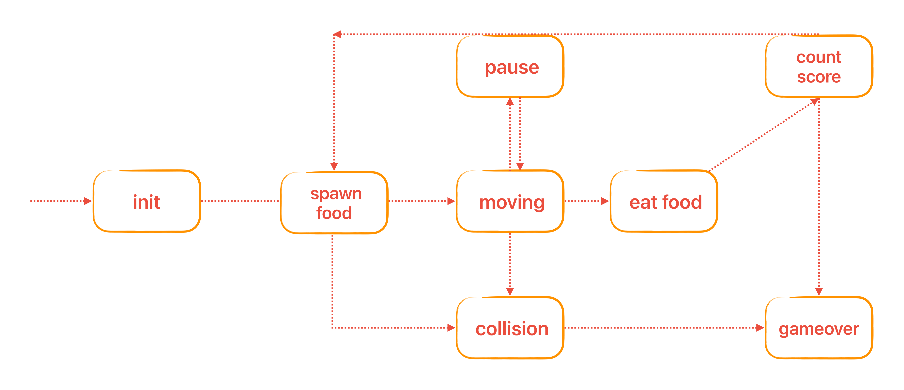
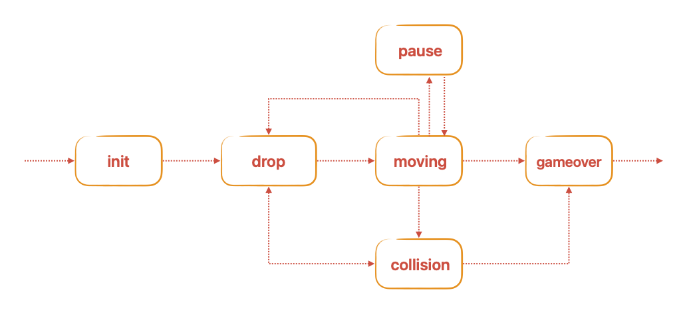

# BrickGame v2.0 aka Tetris and Snake

## Introduction

BrickGame v2.0 is a console-based Tetris and Snake games developed in C and C++ with QT. It features classic Tetris and Snake gameplay with additional mechanics
such as score counting, level progression, and high score tracking.

## Snake Game Features

- Classic Snake gameplay with the following mechanics:

  - Continuous snake movement
  - Direction change control
  - Snake growth when eating food
  - Movement acceleration (hold key)
  - Score and high score display
  - Game over on wall or self-collision

- Controls
  - Support for all physical console buttons:
  - Start new game - Enter
  - Pause - 'p'
  - End game - 'q'
  - Move left - left arrow
  - Move right - right arrow
  - Move up - up arrow
  - Move down - down arrow
  - Acceleration - Space

-Game Field

    - Matrix-based game field with dimensions 10x20 pixels
    - Random food spawning in empty cells
    - Field boundary display

- Scoring and Level System

  - 10 points awarded for each food eaten
  - Level increase every 50 points
  - Movement speed increase with each level
  - High score persistence between games

- Win/Loss Conditions
  - Wall collision
  - Self-collision (snake body)
  - Win condition:
  - Reaching snake length of 200 units

## Tetris Features

- Classic Tetris gameplay with the following mechanics:
  - Rotation of tetrominoes
  - Horizontal movement of tetrominoes
  - Accelerated tetromino falling (by holding the down arrow key)
  - Display of the next tetromino
  - Line clearing
  - Game over when the tetromino reaches the top of the game field
- Support for all physical buttons on the console:
  - Start new game - Enter
  - Pause - 'p'
  - End game - 'q'
  - Move left - left arrow
  - Move right - right arrow
  - Move down - down arrow
  - Rotate - Space
- Matrix-based game field with dimensions corresponding to the console's size
  (10x20 pixels)
- Proper stopping of tetrominoes after reaching the bottom or colliding with
  another tetromino
- Unit tests for the game logic library, achieving at least 90% code coverage

- Score Calculation

  - 1 line cleared: 100 points
  - 2 lines cleared: 300 points
  - 3 lines cleared: 700 points
  - 4 lines cleared: 1500 points

### High Score Tracking

- Display of the player's current score and highest score achieved
- Highest score is stored in a file or embedded database and persists between
  game sessions

### Level Progression

- Progression of levels every 600 points
- Increasing level increases the speed of tetromino falling

## Installation

1. Clone the repository.
2. Navigate to the `src/` directory.
3. To install the project run `make install`
4. To start playing console interface run `make run`
5. To start playing desktop interface run `make run_desktop`

## Usage

- Use the arrow keys to move and rotate tetrominoes.
- Press the down arrow key to make tetrominoes fall faster.
- Press the up arrow key to rotate tetrominoes.

## Fsm Finite State Machine (FSM) Diagram

A diagram showing the FSM used in the game logic:

- snake
  
- tetris
  
